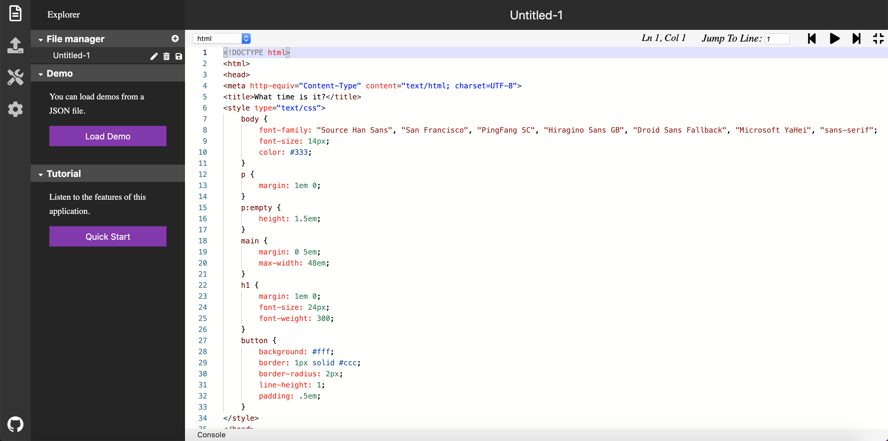

# monaco-speech-editor

[](https://opensource.org/licenses/MIT)

Monaco Speech Editor 是一款在线代码编辑器。内置强大的语音辅助功能，以帮助视障人群阅读、编辑和编译代码。



## 快速开始

 点击[本链接]( https://luochang212.github.io/gadget/monaco-speech-editor/)，在线运行应用。 
 


## 本地运行

因为 Monaco Speech Editor 是一个用传统前端方式写成的，不依赖于任何框架的静态网页，因此很容易在本地运行。

首先，下载本仓库。

```
git clone https://github.com/luochang212/monaco-speech-editor.git
```

然后，打开 `monaco-speech-editor` 文件夹。

最后，点击 `index.html`，此应用将在本地浏览器运行。

## 特性

文件管理系统:

- 新建文件
- 删除文件
- 重命名文件
- 上传文件
- 下载文件
- 恢复已删除的文件

控制台:

- 显示 HTML 文件的渲染结果
- 把渲染结果在新标签页中打开
- 把渲染结果在新窗口中打开
- 打印 console.log() 函数的输出

主题:

- 日间模式
- 夜间模式

辅助功能:

- 工具栏: 包括语法高亮，光标跳转，播放下一行，播放当前行，播放下一行。

- 朗读模式: 包括字符模式，代码模式，音乐模式，概述模式。

- 辅助切换: 这是一个设置列表，按上键和下键切换设置条目，按左键和右键切换设置开关。

- 线性索引: 这是一个功能和快捷键列表。

## 初始化编辑器设置

如果你是一个视障用户，请打开上面的链接，并在链接之后加上路由 `#tutorial`。这会触发一个语音引导，该语音引导将教你如何使用以及探索本应用的功能。（PS: 因为 [Google 公司的政策](https://www.chromestatus.com/feature/5687444770914304)，通过路由自动播放语音的功能可能无法在 Google Chrome 以及使用其内核的其他浏览器上使用。但是用户仍能通过编辑器首页的按钮播放本语音教程。）

如果你是一个拥有正常视力的用户，并且不想被本软件的自动语音播放事件打扰。只需在原网页链接后增加路由 `#mute` 即可静止所有自动语音播放事件。 

<details>
<summary>完整路由列表</summary>

| 路由             | 对应的初始化设置                                    |
| --------------- | ------------------------------------------------- |
| #load-demo      | load demo                                         |
| #dark           | turn on night mode                                |
| #full-screen    | full screen                                       |
| #run            | open console bar                                  |
| #tutorial       | play audio tutorial                               |
| #spotlight      | turn on spotlight                                 |
| #linear-index   | turn on linear index                              |
| #character-mode | trun on character mode                            |
| #code-mode      | turn on code mode                                 |
| #overview-mode  | turn on overview mode                             |
| #voice-feedback | turn on voice feedback                            |
| #voice-cue      | turn on voice cue                                 |
| #mute           | disable any autoplay event                        |
| #dark&run       | turn on night mode and console bar                |
| #dark&mute      | turn on night mode and disable any autoplay event |

</details>


## 依赖

- [Monaco Editor](https://github.com/microsoft/monaco-editor)

- [Web Speech API](https://w3c.github.io/speech-api/)

## FAQ

❓编辑器是否支持移动端浏览器或者移动端网络应用框架？

不支持。因为本编辑器的两个依赖，Monaco Editor 和 Web Speech API 均不支持移动端浏览器和移动端应用框架。其中，Web Speech API 在部分移动端上完全无法使用。

❓如何使用路由加载 Monaco Speech Editor 的初始设置？

比如通过链接[https://luochang212.github.io/gadget/monaco-speech-editor/#dark&mute](https://luochang212.github.io/gadget/monaco-speech-editor/#dark&mute)打开网页，由于加载了路由设置`#dark&mute`，Moanaco Speech Editor 将自动为你开启夜间模式，并禁止所有的自动播放事件。更多个性化设置，请查看完整路由列表。

## 执照

MIT License
